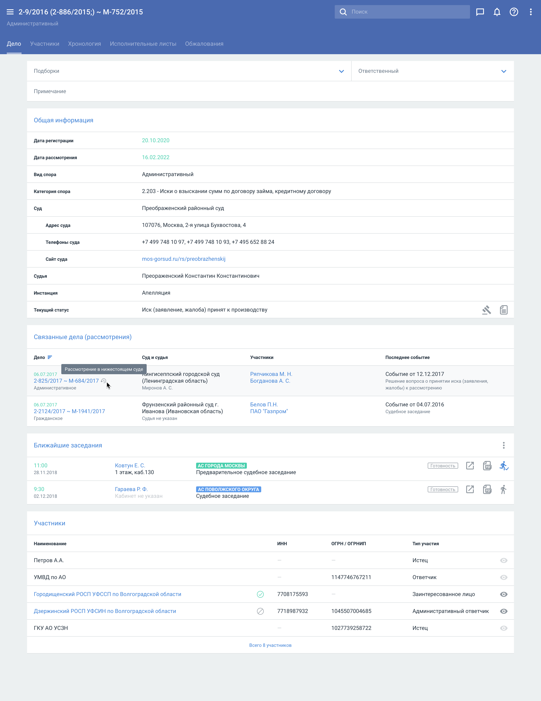

# СОЮ / Календарь 

**Задачи**: [Epic](https://jira.parcsis.org/browse/CBAPP-5077) / [UserStory](https://product.case.one/#/case/1796c49a-dd67-1487-de63-b00c0098367b/view/)

**Команда**: Чугункина Алена / Аналитик, Царьков Сергей / Архитектор  

**Дата:** 10 ноября 2023

## Краткий обзор потребности

### Заинтересованные стороны

* ООО "БАШЮРИСТ"  (Предположительно Casebook необходим для outsource юристов)
* ООО СТРАХОВАЯ КОМПАНИЯ "ГЕЛИОС" (Предположительно Casebook необходим для inhouse юристов)
* ООО "СЭРК" (Предположительно Casebook необходим для outsource юристов)

### Причина отказа

Полученные данные от "продавцов": Нет календаря дел СОЮ. Клиенты занимаются делами общей юрисдикции. 
Данный отзыв по всем трем клиентам.

### Потребность

На основании данных полученных от "продавцов" можно сделать вывод, что для данных клиентов стоит острая необходимость видесь список заседаний по делам, которые в работе у юристов. Сотрудник клиента должен видеть: близжайшее событие-заседание, по какому делу это заседание и когда оно должно пройти.

### Бизнес цель
На основании причины отказа и выявленной потребности можно выделить бизнес цель:
**Я, КАК**
пользователь Casebook,
**ХОЧУ**
видеть в календаре заседаний, в карточке организации предстоящие заседания СОЮ,
**ЧТОБЫ**
было удобно отслеживать свои судебные заседания СОЮ

## Исследования
В рамках приоритетного направления - *доработка СОЮ*, произведен ресерч наличия в данных из АПИ СОЮ информации о *будущих судебных заседаниях* по делам СОЮ.
Статистика наличия событий в делах СОЮ на 20 июля 2023:

|Наименование типа события | Количество событий | Количество дел |
|---|---|---|
|Вынесение финального решения | 115383850 | 80570668 |
|**Назначение заседания**| **30338979** | **26154716** |
|Оставление без движения|	11045283|	10645235|
|Возвращение	|10859596	|9688560|
|Приостановление	|7278406|	6442332|
|Возобновление	|5742140|	5235513|
|Подача жалобы	|691312|	672813|

**Хорошо бы получить пример как собирали статистику**

Пример дела с будующим заседанием: [2a-12606/2023](https://krasnodar-prikubansky--krd.sudrf.ru/modules.php?name=sud_delo&name_op=case&case_id=275663997&case_uid=19d7897e-8f8a-4b72-af62-64a4edbf301d&delo_id=41&case_type=0&new=0&srv_num=1)

Маппинг событий СОЮ : [Метод](https://docs.google.com/spreadsheets/d/16y2yk4-BLQGJNC8eMrLTF-1DbjSJKCqKXZFiEKj5nVU/edit#gid=0) 

**Из какого метода надо написать**

## Предлагаемое решение

### Карточка дела СОЮ

#### Use case
**Юрист-судебник**, специализирующийся на ведении судебных дел в судах общей юрисдикции, заходит в карточку дела СОЮ и видит информацию о наличии/отсутствии будующих судебных заседаний в просматриваемом деле чтобы:

* Своевременно подготовится к участию в деле в качестве представителя (написать позицию по делу)
* Подготовить процессуальные документы для участия в деле и заблаговременно направить их копии сторонам, участвующим в деле

В карточке СОЮ находится блок "Ближайшие заседания". Блок находится до блока "Участники" и после блока "Общая информация".

Состав блока:
|Близжайшие заседания| | | |
|---|---|---|---|
|Дата и время судебного заседания (формат ЧЧ:ММ, ДД.ММ.ГГГГ) | ФИО судьи (формат Фамилия И.О.) | Наименование суда. Наименование события (Например - Судебное заседание, Предварительное судебное заседание, Беседа и тд.) |Кнопка "Готовность", Кнопка "ПДФ", Кнопка "Я иду"|

В случае, если судебных заседаний нет, то отображается заголовок "Ближайших заседаний нет".
В качестве судебных заседаний для отображения используются события = будущим судебным заседаниям (т.е. те, которые еще не прошли) в таблице на вкладке ["Назначение заседания"](https://docs.google.com/spreadsheets/d/16y2yk4-BLQGJNC8eMrLTF-1DbjSJKCqKXZFiEKj5nVU/edit#gid=0)

**Из какого метода CSL это брать**

### Календарь заседаний
#### Use case
**Юрист-судебник**, специализирующийся на ведении судебных дел в судах общей юрисдикции, открывает календарь заседаний ознакамливается с информацией по наличию/отсутствию судебных заседаний по делам СОЮ чтобы:

* Вести учет своих судебных заседаний за определенный период времени (неделя, месяц, квартал и тд)
* Запланировать участие в судебных заседаниях на определенный период времени (неделя, месяц, квартал и тд)
* В случае наличия пересечений в судебных заседаниях, подготовить процессуальный документ в суд либо попросить коллегу поучавствовать 
* Отметить факт своего участия/подготовки в судебном заседании

**Руководитель юридического отдела**, специализирующегося на ведении судебных дел в судах общей юрисдикции, открывает календарь заседаний, фильтрует календарь по фильтру "Готовность" чтобы:

* Проверить ко всем ли судебным заседаниям готовы его подчиненные

1. Создание нового календаря

При создании нового календаря/редактировании ранее созданного календаря заседаний пользователь может выбрать подборки СОЮ и судебные дела СОЮ.

При выборе подборки в дропдауне пользователю доступны для выбора имеющиеся у него подборки СОЮ.

При добавлении атрибутов отслеживания судебных заседаний пользователю доступны атрибуты для отслеживания судебных заседаний по делам СОЮ, такие как:

* Номер дела
* Суд в деле СОЮ
* Вид спора СОЮ
* Дата регистрации дела СОЮ
* Участник дела СОЮ

При нажатии кнопки  открывается окно со следующим составом данных:

* Номер дела (кликабельный, при нажатии переход на карточку дела)
* Дата заседания в формате ДД.ММ.ГГГГ
* Запланированное время заседания в формате ЧЧ.ММ
* Суд
* Судья

2. Фильтрация и сортировка календаря заседаний.

При просмотре календаря заседаний пользователь может отфильтровать результат исходя из принадлежности судебного заседания к арбитражному делу или к делу СОЮ.

### Предположительная нагрузка

Средний ожидаемый RPS - 0,400 запросов в секунду. 

Пиковый ожидаемый RPS - 15 запросов в секунду. 

P95 среднее время ответа - 800 ms.

Максимально допустимое время ответа (SLA) - 2s.

**На основании каких данных был произведен расчет?**

### Предварительная оценка

## Альтернативное решение

### Предварительная оценка

## Принятое решение
> Описание на основании чего было принято решение и какое именно

## Требования
> В этом разделе рассматриваются конкретные требования к проекту, кто в нем участвует и контекст, в котором решение будет разработано и предоставлено. То есть тот минимальный функционал, который должен покрыть потребности

### Функциональные требования
> Описывает конкретные функциональные возможности, которые система должна предоставлять в четких, выполнимых терминах. API, Задачи и т.д. 

### Нефункциональные требования
> Охватывает качество или критерии функционирования системы, такие как производительность, масштабируемость и безопасность.

### Ограничения
> Перечисляются ограничения, в рамках которых должна работать команда проекта, такие как технологические, финансовые или временные ограничения.

### Риски
>Этот раздел описывает потенциальные риски, которые могут повлиять на успешную реализацию или функционирование решения. Риски следует регулярно пересматривать, переоценивать и обновлять по мере продвижения проекта. Для каждого риска следует предоставить стратегии смягчения и реагирования.
